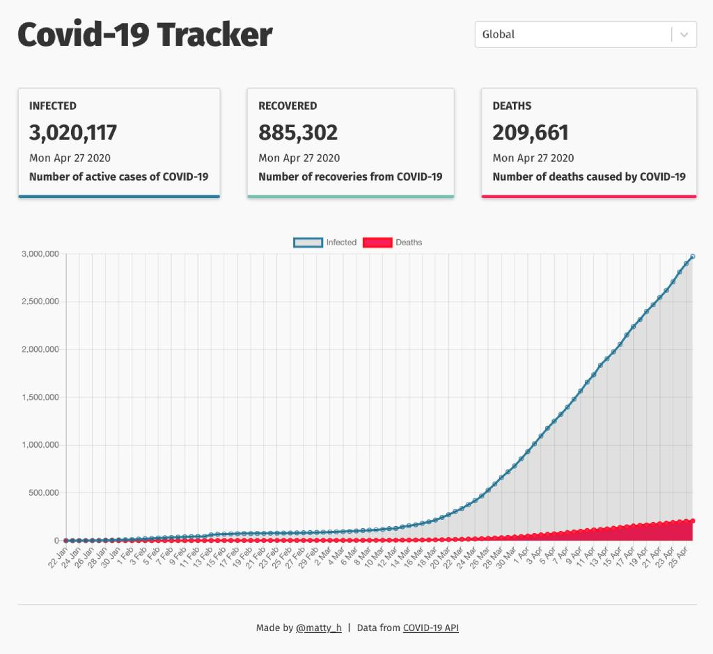

# Global Covid-19 tracker

This repository contains a Covid-19 tracker app built with React.js that fetches the latest global stats and displays data values via Chart.js

[View App](https://global-tracker-covid-19.netlify.app/)



## Getting Started

```bash
$ git clone https://github.com/matt-harris/react-covid19-tracker.git

$ cd creact-covid19-tracker

$ npm install

$ npm start
```

> Open [http://localhost:3000](http://localhost:3000) to see the app running in dev mode.

## Deployment Status

[](https://app.netlify.com/sites/global-tracker-covid-19/deploys)

## Author

- **Matt Harris** - [matt-harris](https://github.com/matt-harris)

## Data Source

Data API provided by https://github.com/mathdroid/covid-19-api
